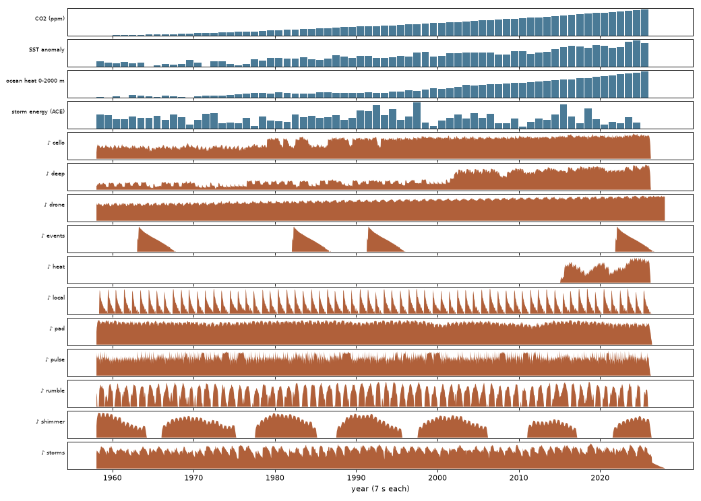
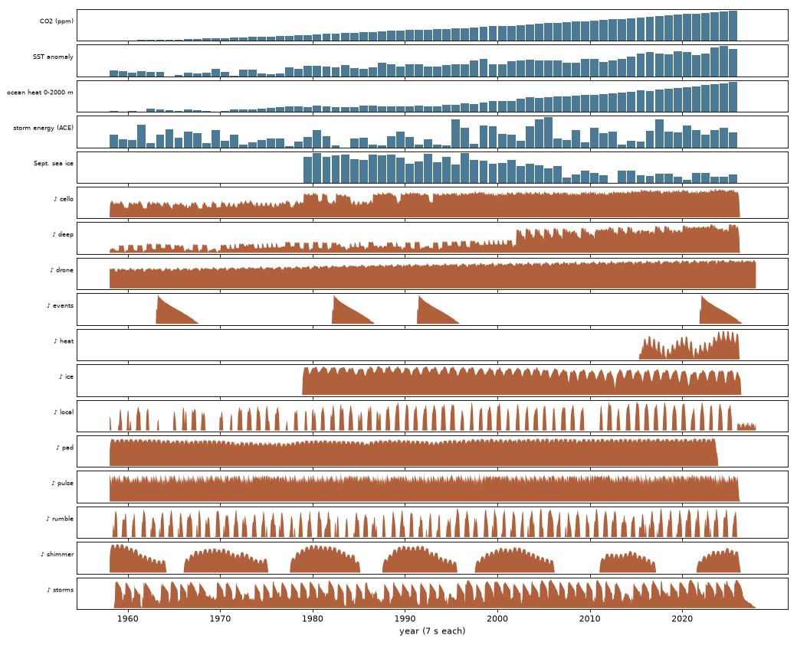

::: {.eyebrow}
1958–2025 · one year per bar · two pieces on one grammar
:::

Two pieces built from the global climate record since the Keeling curve began in 1958. One bar is one year: seven seconds, four beats for the seasons, twelve pulses for the months. The things that only rise, like carbon dioxide, ocean heat and sea-surface temperature, live in the low drone and the strings, and the whole mix gets about 4 dB louder from the first decade to the last. Storms are the deep drums. ENSO sets the chords. The two pieces share their global layers and differ in their ocean.

::: {.callout-note appearance="simple"}
**Status: a first render.** These pieces were built and balanced by measurement, and checked with the plots below, but they have not yet been refined by ear. Graham chose the data and gave direction; the musical choices are Claude Code's first attempt. See [How this was made](about.qmd).
:::

::: {.grid}
::: {.g-col-12 .g-col-md-6 .piece-card}
### Pacific
Key of D · 8:10

The Pacific Decadal Oscillation sets the mode. Typhoons in the West Pacific sound on the left and hurricanes in the Northeast Pacific on the right, as on a map. Each spring the Kettle River, which crosses the BC–Washington border near Grand Forks, blooms at the date of its annual peak.

:::

::: {.g-col-12 .g-col-md-6 .piece-card}
### Atlantic
Key of A · 8:10

The Atlantic Multidecadal Oscillation sets the mode, and winter wind follows the North Atlantic Oscillation. Atlantic hurricanes are the drums. From November 1978, when satellites began measuring it, Arctic sea ice enters as a high glass voice that breathes with the seasons and thins over the decades.

:::
:::

## Watch and listen

::: {#cviz .cviz}
<noscript>
<p>The visualizer needs JavaScript. The pieces: <a href="audio/climate_pacific_1958_2025.mp3">Pacific (MP3)</a> · <a href="audio/climate_atlantic_1958_2025.mp3">Atlantic (MP3)</a></p>
</noscript>
:::

<script src="climate/viz.js" defer></script>

**How to read the spiral.** Each ring is a year: 1958 at the centre, 2025 at the edge, January at the top, running clockwise. The ring is drawn as you hear it.

- **Colour** is the global ocean surface temperature anomaly, from <span class="ramp"></span> cool blue to ember.
- **Thickness** is ENSO strength: the ring swells in strong El Niño and La Niña months.
- **Sparks** are storms at their peak, larger for higher categories. Each one flares as its drum sounds, and a ring marks a landfall. In the Pacific piece, West Pacific typhoons are pale blue and Northeast Pacific hurricanes pale amber.
- **Pacific:** green blooms mark the Kettle River's annual peak, larger for bigger years. **Atlantic:** from November 1978, a white line along the inside of each ring is Arctic sea-ice extent. It swells each winter and thins each September.
- **Grey marks** are volcanic eruptions. A **red halo** appears while the high violin plays (global temperature above +0.8 °C). The glow at the centre follows the contrabass (ocean heat), and the twinkles at the playhead follow the shimmer (sunspots).

The strip under the spiral is a timeline: click or drag it to move through the years. The labels below it light up as each instrument plays. Tick **both side by side** to watch the two oceans at once while you listen to one. In the big El Niño years, the Pacific sparks crowd while the Atlantic ones thin.

The spiral and strip are drawn from the same data as the music (`scripts/export_climate_viz.py`). Sunspot numbers and ocean heat content are not published as values (see [Sources and licences](#sources-and-licences)), so those two layers appear only as the loudness of their instruments.

## How to listen

Each layer is tagged: <span class="src R">R</span> retrieved (a measured record), <span class="src D">D</span> derived (computed from a record, with a choice made along the way), <span class="src S">S</span> simulated. There is no simulated layer in these two pieces.

| What you hear | Data | |
|---|---|---|
| **Drone** (synth and pipe-organ pedal): louder and more open as it rises, and it *breathes* once a year | Mauna Loa CO₂, deseasonalized; the seasonal cycle is the Northern Hemisphere's plants taking in and releasing carbon | <span class="src R">R</span> |
| **Cellos** on chord tones, one voice early and three by the late 1990s | Global ocean surface temperature anomaly | <span class="src R">R</span> |
| **Contrabass** below the cellos: the deep ocean filling, root then root and fifth | Ocean heat content, 0–2000 m (IAP v4.2) | <span class="src R">R</span> |
| **Chords**, two per year: El Niño lifts the harmony (VI, or III in a strong event), La Niña sinks it (iv); neutral years circle i–VII–i–v | Oceanic Niño Index | <span class="src R">R</span> |
| **Monthly pulse** (piano in the Pacific, harp in the Atlantic): louder in strong ENSO, higher in El Niño, lower in La Niña | Oceanic Niño Index | <span class="src R">R</span> |
| **Mode and pad**: Dorian in the warm phase, Aeolian in the cool; the pad brightens with the index | PDO or AMO, 3-year mean, with a small dead band so the mode doesn't flicker | <span class="src D">D</span> |
| **Storms**: tropical storm = a rubbed bass drum; hurricane = tuned timpani; major hurricane = timpani, concert bass drum and a sub-bass boom that briefly ducks the drone; Category 5 = tam-tam; landfall = cymbal; a low rumble follows each season's accumulated energy (ACE) | NOAA HURDAT2 (Atlantic, Northeast Pacific) and IBTrACS (West Pacific) best tracks, placed at each storm's peak | <span class="src R">R</span> |
| **Shimmer**: a high pad and glockenspiel, fullest at each solar maximum | Monthly sunspot number | <span class="src R">R</span> |
| **Heat**: a held high violin once the 12-month global mean passes +0.8 °C | NASA GISTEMP v4 | <span class="src R">R</span> |
| **Volcanoes**: a gong, and the drone darkens for about two years | Eruption dates; the cooling envelope is a chosen shape | <span class="src D">D</span> |
| *Pacific:* **spring bloom** of harp and piano, larger for bigger years | Kettle River near Laurier, WA: the date and size (rank) of each year's peak daily flow | <span class="src R">R</span> |
| *Atlantic:* **winter wind**, stronger when the NAO is positive | North Atlantic Oscillation, December–March | <span class="src R">R</span> |
| *Atlantic:* **glass voice**: its loudness follows each month's ice extent; its number of voices follows that year's September minimum | Arctic sea-ice extent, NSIDC Sea Ice Index | <span class="src R">R</span> |

**The pair is a conversation.** ENSO runs through both. In the big El Niño years (1982–83, 1997–98, 2015–16) the Pacific storm drums crowd and the Atlantic ones thin, a well-documented link between ENSO and Atlantic hurricane activity.

## Check plots

Each year's data (blue) against each instrument's loudness (orange). A layer should speak when its data says it should.

::: {.panel-tabset}
## Pacific
{fig-alt="Data lanes for CO2, SST, ocean heat and storm energy above the loudness of each instrument, 1958 to 2025, Pacific piece."}

## Atlantic
{fig-alt="Data lanes for CO2, SST, ocean heat, storm energy and September sea ice above the loudness of each instrument, 1958 to 2025, Atlantic piece."}
:::

## Listening guide

Every timed event in each score, generated from the render.

::: {.callout-note collapse="true" appearance="minimal"}
## Pacific: 73 events

:::

::: {.callout-note collapse="true" appearance="minimal"}
## Atlantic: 71 events

:::

## What to be careful about

- **Early storms are undercounted.** Before routine satellite coverage (about 1966), and in the Northeast Pacific into the 1970s, weaker storms were missed. The sparse early drums are partly fewer *observed* storms.
- **Early West Pacific intensities are uncertain.** The US Joint Typhoon Warning Center's wind estimates from the 1950s–70s are thought to run high, so some early "Category 5" tam-tams may be overstated. The Pacific guide names only the eight strongest West Pacific Category 5 storms.
- **Records end at different times.** The AMO index stopped updating in January 2023, so its pad falls silent there. West Pacific best tracks currently end in December 2024. Both gaps are marked in the guides, not filled.
- **Sea ice starts in November 1978**, when the satellite record starts. Longer histories reconstructed from ship logs, ice charts and aircraft exist, but they are a different kind of record and are not used here.
- **The ocean phases lag.** The PDO and AMO are smoothed over three years, so their turns arrive about two years after the conventional dates (the 1976–77 Pacific shift sounds in 1980).
- **Interpretive choices** include the volcanic cooling shape (Hunga Tonga is treated as mostly water vapour and barely darkens the drone), the ENSO-to-chord table, and every loudness curve. None of them is a measurement.

## Sources and licences

- **CO₂:** NOAA Global Monitoring Laboratory, Mauna Loa monthly mean (the Keeling curve).
- **ENSO, NAO:** NOAA Climate Prediction Center, Oceanic Niño Index and North Atlantic Oscillation.
- **PDO, global ocean surface temperature:** NOAA National Centers for Environmental Information (ERSSTv5; Climate at a Glance).
- **AMO:** NOAA Physical Sciences Laboratory.
- **Global temperature:** NASA GISS Surface Temperature Analysis (GISTEMP v4).
- **Ocean heat content:** Cheng, L. et al. (2024). IAPv4 ocean temperature and ocean heat content gridded dataset. *Earth System Science Data* 16, 3517–3546. [doi:10.5194/essd-16-3517-2024](https://doi.org/10.5194/essd-16-3517-2024). Institute of Atmospheric Physics, Chinese Academy of Sciences.
- **Storms:** NOAA National Hurricane Center HURDAT2 (Atlantic; Northeast and Central Pacific). NOAA NCEI International Best Track Archive for Climate Stewardship (IBTrACS) v04r01 (West Pacific).
- **Arctic sea ice:** National Snow and Ice Data Center, Sea Ice Index, version 4 (G02135).
- **Sunspots:** WDC-SILSO, Royal Observatory of Belgium, Brussels (CC BY-NC 4.0).
- **Kettle River:** U.S. Geological Survey, gauge 12404500, Kettle River near Laurier, WA.
- **Volcanic eruptions:** Smithsonian Institution Global Volcanism Program (dates).
- **Instruments:** VSCO 2 Community Edition, Versilian Studios (CC0), plus synthesizers written in Python.

The sunspot numbers are licensed for non-commercial use only, and the heat-content series' redistribution terms are not yet confirmed. Those two series are therefore not stored in the repository; `fetch_climate.py` downloads them. Because the music is derived in part from non-commercial data, **these two pieces are released under CC BY-NC-SA 4.0**, not the CC BY-SA 4.0 of Water Year Rings.

## Source code

::: {.callout-note collapse="true" appearance="minimal"}
## `climate_pair.py`: the score for both pieces
```python

```
:::

::: {.callout-note collapse="true" appearance="minimal"}
## `fetch_climate.py`: data downloads and parsing
```python

```
:::

::: {.callout-note collapse="true" appearance="minimal"}
## `synth.py`: the synthesizers
```python

```
:::

To rebuild: from `scripts/`, run `python fetch_climate.py`, then `python climate_pair.py pacific` and `python climate_pair.py atlantic`, then `python climate_check_plot.py pacific` (and `atlantic`) and `python export_climate_guide.py`, then `python export_climate_viz.py` for the visualizer data. The instrument samples come from `fetch_samples.py`, as for Water Year Rings.
