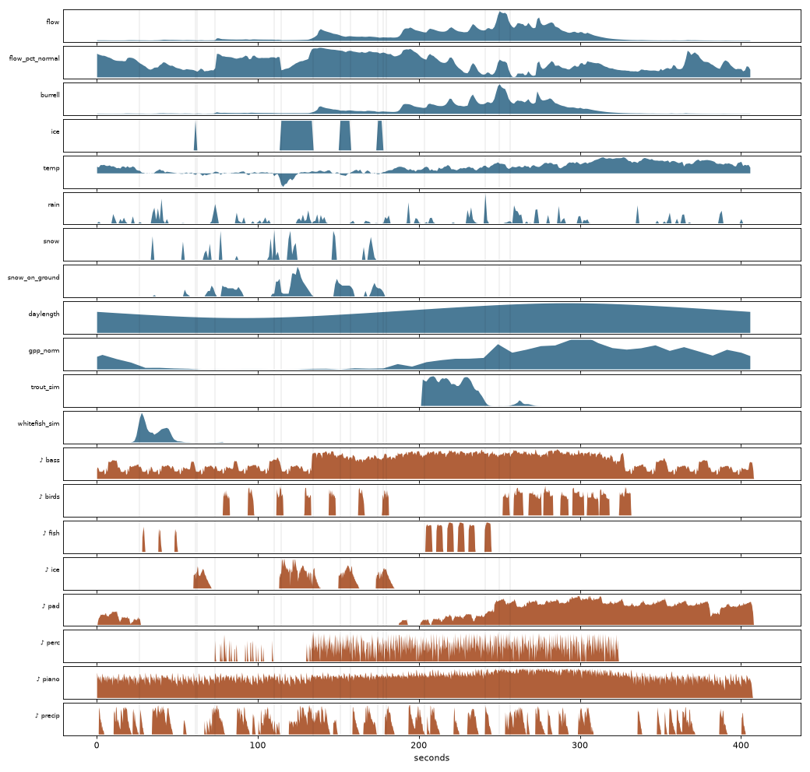
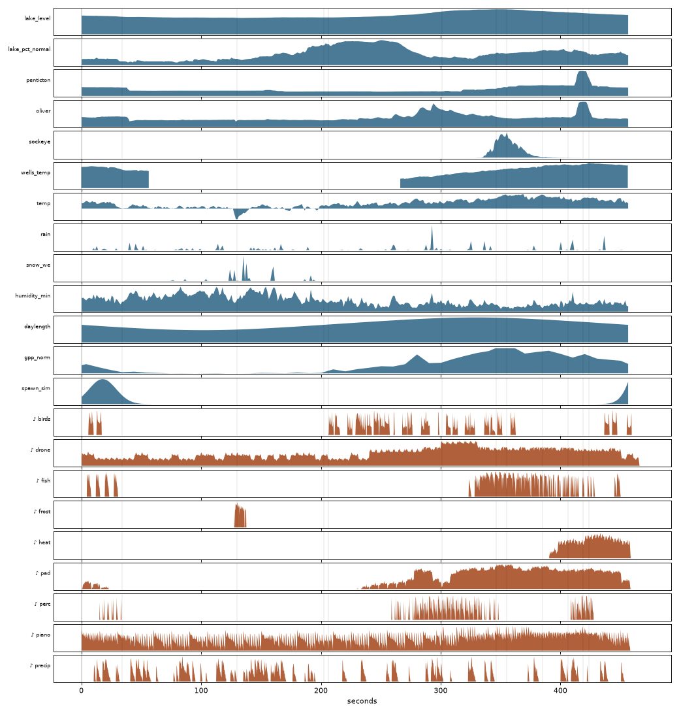

## The idea in one paragraph

Sonification means turning data into sound. The usual failure is mapping one number straight to pitch, which sounds like an alarm. These pieces separate timescales instead. **Slow** signals (the season, lake level, how far the year sits from its 15-year normal) set the **harmony**. **Medium** signals (streamflow, plant productivity) set **density and presence**. **Fast or eventful** signals (a rainy day, ice forming, fish passing a dam) trigger **short motifs**. A repeating piano figure holds it all together: a minimalist form, where one pattern stays constant and everything around it changes.

## Design principles

1. **Separate the timescales**, as above.
2. **Minimalism as the form.** A piano ostinato (a short repeated figure) is the constant. The data changes its density, register, harmony and surroundings.
3. **Consonance is enforced.** Every pitched note is drawn from the current chord, and chords pass two guards against clashing intervals (see *Consonance guards* below).
4. **Every layer must be audible when its data is active, and nothing may drown it out.** This is checked by measurement (see *Quality checks*).
5. **Provenance is visible.** Every layer is tagged <span class="src R">R</span> retrieved measurement, <span class="src D">D</span> derived, or <span class="src S">S</span> simulated timing.

## Data

| Record | Source | Used for | |
|---|---|---|---|
| Granby River at Grand Forks, daily discharge + data flags | Water Survey of Canada 08NN002 | flow, anomaly, hydrologic phase, **ice** (the "Ice Conditions" flag) | <span class="src R">R</span> |
| Burrell Creek above Gloucester Creek | WSC 08NN023 | hand-drum drive | <span class="src R">R</span> |
| Billings climate station | ECCC daily climate, station 1100 | temperature, rain, snowfall, snow on ground | <span class="src R">R</span> |
| Okanagan Lake at Kelowna, level | WSC 08NM083 | lake drone, anomaly, lake phase | <span class="src R">R</span> |
| Okanagan River at Penticton (dam outflow) | WSC 08NM050 | piano density | <span class="src R">R</span> |
| Okanagan River near Oliver | WSC 08NM085 | soft percussion | <span class="src R">R</span> |
| Summerland climate station | ECCC daily climate, station 979 | temperature, precipitation, humidity | <span class="src R">R</span> |
| Gross primary productivity (photosynthesis) | NASA MODIS MOD17A2HGF, 8-day, 3×3 km mean, via ORNL DAAC | string pad | <span class="src R">R</span> |
| Adult sockeye count and water temperature | Wells Dam, Columbia Basin Research DART | marimba runs, thermal stress | <span class="src R">R</span> |
| Day length | solar geometry at each site's latitude | mode brightness | <span class="src D">D</span> |

Hydrometric and climate data come from ECCC's GeoMet OGC API (daily means, 2010–2024, so every day of 2024 can be compared with its 15-year normal). Wells Dam sits on the Columbia just below the Okanagan confluence and above the Wenatchee, so its sockeye are overwhelmingly Okanagan-bound, but it is not an Okanagan gauge.

## Time

One water year runs from October 1 to September 30: 366 days in 2023–24. **One bar of music is three days**, so the year is 122 bars. The Granby piece runs at 72 beats per minute (a bar is 3.3 seconds) and the Okanagan at 64 (3.75 seconds). The slower tempo suits a large regulated lake.

Two views of each record are used:

- **Level within the year**: where today sits between the year's low and high. This drives density.
- **Anomaly**: where today sits among all 2010–24 values within a week of the same calendar date, as a percentile. 50% is normal. This drives mood. It separates "high for this year" from "unusual for the time of year".

## Harmony

### Modes, dark to bright

A **mode** is a set of seven notes. Six of them can be lined up from dark to bright so that **each differs from its neighbour by exactly one note**:

| Mode | Notes in D | Feel |
|---|---|---|
| Phrygian | D E♭ F G A B♭ C | darkest (not used) |
| Aeolian | D E F G A B♭ C | natural minor |
| Dorian | D E F G A B C | minor, lifted |
| Mixolydian | D E F♯ G A B C | major, relaxed |
| Ionian | D E F♯ G A B C♯ | major |
| Lydian | D E F♯ G♯ A B C♯ | brightest |

Moving one step along this ladder is the smallest change of mood music can make. The target step is set by the season (mostly day length, partly temperature). The year's anomaly nudges it up to one step darker or brighter. The mode can change only every eight bars, and only by one step, so the listener hears a drift, never a lurch. Phrygian is left out because its second note sits a half step above the home note and clashes under a sustained piano. Lydian, the top rung, is reachable only when an unusually high year lands near the season's brightest point. Neither 2024 piece gets there: the Granby moves between Aeolian and Ionian, and the Okanagan between Aeolian and Mixolydian.

### Hydrologic phase chooses the chord loop

Each day is labelled with a phase from the flow or lake level, and each phase has its own four-chord loop. Numerals are chords built on steps of the scale; upper case is major, lower case minor.

| Granby phase | Rule (share of the year's peak flow) | Loop | Character |
|---|---|---|---|
| dormant | ice, or under 10% in Nov–Feb | i VI i iv | still |
| rising | climbing more than 0.4% per day | i iv v VI | climbs, unresolved |
| peak | over 50% | VI iv i v | broad |
| recession | falling more than 0.3% per day | i VII VI iv | bass steps down |
| low | otherwise | i iv i VI | sparse |

| Okanagan lake phase | Rule | Loop |
|---|---|---|
| filling | rising more than 0.4 cm/day | i III iv v (bass climbs with the water) |
| full | top 15% of the year's range | VI III VII i |
| drawdown | falling more than 0.25 cm/day | i VII VI v (bass walks down) |
| winter | otherwise | i VI iv VI |

A phase must hold for at least 6 bars (Granby) or 8 bars (Okanagan), so a two-day wobble doesn't flip the harmony. Chords change every 2 bars on the river and every 4 on the lake.

### Voicing and consonance guards

Chords are voiced as **add9** (root, third, fifth, ninth, no seventh), the open colour common in cinematic and modern-classical music. Each new chord is placed as close as possible to the previous one, so the hands barely move between changes. Two guards keep everything consonant:

- A **diminished** chord (root to fifth is a tritone) is replaced by the chord a third below. It contains the same upper notes over a stable root.
- A **flat ninth** (a half step above the root) is replaced by the seventh.

An exhaustive check over every chord in every mode used found no remaining tritone or half-step against a root. Melodic material (harp raindrops, glockenspiel snow, fish motifs, marimba runs) uses only the current chord's tones, so fast figures never land on a rubbing passing note.

## Instruments

- **VSCO 2 Community Edition** (Versilian Studios, public domain, CC0): upright piano, harp, cello and violin sections, contrabass, flute, marimba, glockenspiel and hand percussion.
- **Bird recordings** from Wikimedia Commons (see *Sources and licences*). A short routine high-passes each recording and cuts out its clearest song phrases.
- **Synthesized textures** for ice: crackle grains, and "singing ice" chirps (a falling tone imitating the dispersive chirp that flexing lake ice makes).

**The sample labels were checked against the audio.** A pitch-detection pass (autocorrelation) found the cello, violin, contrabass, flute, marimba and glockenspiel files are named one octave lower than they sound. The library names middle C as C3; this code names it C4. Piano and harp matched. Without that check, every string part would have played an octave off against the piano.

A note is played by picking the nearest recorded pitch at the dynamic layer closest to the requested loudness, then re-pitching by resampling (never more than two semitones). Long notes are held by overlapping several takes with crossfades, the way string players stagger their bow changes.

## Layer by layer

### Granby River (key of D)

| Layer | Data | What you hear |
|---|---|---|
| Piano ostinato | Granby flow <span class="src R">R</span> | half notes in winter, then quarters, eighths, and eighths with a soft upper echo at full flow |
| Contrabass and cello | Granby flow <span class="src R">R</span> | the chord root, with the cello adding a fifth at high flow |
| Violins | MODIS productivity <span class="src R">R</span> | swell in with green-up, fade in the fall |
| Ice | WSC ice flag + air temperature <span class="src R">R</span> | freeze: falling glockenspiel + bowed cymbal; frozen: crackle, denser when colder, and singing-ice chirps below −4 °C; breakup: cymbal swell into a rising harp |
| Rain and snow | Billings rain and snowfall <span class="src R">R</span> | harp notes per rainy day, glockenspiel per snowy day, more for heavier days |
| Room | snow on the ground <span class="src R">R</span> | deep snow switches the reverb to a dark, short room, because snow absorbs sound |
| Hand drums | Burrell Creek flow and flashiness <span class="src R">R</span> | tumba, conga, shaker; a 3-3-2 log-drum figure at the freshet peak |
| Redband trout | spawning window <span class="src S">S</span> | a short rising flute figure (modelled: air temperature near 8 °C, April–June) |
| Mountain whitefish | spawning window <span class="src S">S</span> | a falling cello pizzicato (modelled: near 4.5 °C, mid-October to early December) |
| Birds | typical arrival windows <span class="src S">S</span> | dipper in winter; Swainson's thrush and bank swallow in summer |

### Okanagan (key of F)

| Layer | Data | What you hear |
|---|---|---|
| Lake drone | Okanagan Lake level <span class="src R">R</span> | a low F held under every chord, louder as the lake fills; cello adds a fifth while it rises |
| Piano ostinato | Penticton dam outflow <span class="src R">R</span> | density follows the release. When the dam holds the flow flat, the piano plays strictly, with no variation in timing or touch |
| Soft percussion | Okanagan River near Oliver <span class="src R">R</span> | log drums, shaker, conga |
| Sockeye | Wells Dam daily count <span class="src R">R</span> | marimba runs climbing the chord; more fish, more notes; runs start higher as the season goes on |
| Thermal stress | Wells water temperature <span class="src R">R</span> | a held high violin note once the water passes 18 °C |
| Spawning | near Oliver <span class="src S">S</span> | low, falling cello pizzicato around mid-October, scaled by run size |
| Violins | MODIS productivity <span class="src R">R</span> | as on the Granby |
| Rain and snow | Summerland precipitation, split by temperature <span class="src D">D</span> | harp / glockenspiel |
| Frost | air temperature below −8 °C <span class="src R">R</span> | ice crackle (January 13, 2024: −21.9 °C) |
| Room | humidity <span class="src R">R</span> | humid days get a long hall, dry days a short bright room |
| Birds | typical arrival windows <span class="src S">S</span> | western meadowlark in spring; sandhill cranes passing in April and late September |

Rare events (fish motifs, birds) fire deterministically: their intensity accumulates bar by bar and a motif plays each time the total crosses a threshold. Random triggering was tried first and once left an entire layer silent through its short window. All remaining randomness (small timing variations, crackle placement) is seeded, so every render is identical.

## Mix

Each layer has its own track with filtering and a send to reverb. The reverbs are synthetic impulse responses: stereo noise whose high frequencies die away faster than its lows, as in real rooms. Data decides which room you are in, as described above. A gentle compressor glues the mix together, then it is normalized to −16 LUFS for listening.

## Quality checks

The mix was balanced by measurement, then judged by ear. For each piece, a check plot sets every data record above the loudness of every instrument track over the whole year. If a record is active and its instrument is silent, it shows. The piano leads, and the other layers sit roughly 7–10 dB beneath it while they play.

{.lightbox}

{.lightbox}

These plots caught two real bugs before release: a layer that never sounded, and an ice-breakup swell that began before the ice had formed.

## The listening companion

The [Listen](listen.qmd) page uses no framework, only features built into every browser:

| Job | How |
|---|---|
| Playback and timing | an HTML `<audio>` element; its current playback time is the single clock everything reads from |
| Animation | `requestAnimationFrame`, redrawing while the music plays |
| The rings | Canvas 2D. The full year is drawn once dim and once lit, and each frame shows the lit copy only up to the playhead |
| Linking sound to picture | how loud each instrument group is, measured 8 times a second from its own audio track ahead of time, then looked up by playback time. That drives the glows, the meters and the drifting particles |
| Data | one JSON file per piece: daily records, per-bar harmony, events and loudness |

The loudness is measured ahead of time rather than live because a browser can only analyse the finished mix, not each instrument separately.

## Reproduce it

Everything runs in Python 3.13 with the pinned packages in `requirements.txt` (`numpy`, `scipy`, `soundfile`, `matplotlib`), plus `ffmpeg`. Run the scripts from `scripts/`.

```bash
pip install -r ../requirements.txt
python fetch_granby.py            # Granby, Burrell Creek and Billings pulls (cached)
python fetch_okanagan.py          # Okanagan, MODIS and DART pulls (cached)
python fetch_samples.py           # VSCO subset + bird recordings + licence manifest
python pilot_granby_wy2024.py     # renders about 7 minutes of audio in about 30 s
python pilot_okanagan_wy2024.py
python pilot_check_plot.py granby_wy2024
python export_companion.py        # data + audio for the listening page
```

By default the sample library goes to `samples/` and the rendered audio to `rendered/`, both inside the repository and both git-ignored. Set `SONIFICATION_SAMPLES` and `SONIFICATION_HEAVY` to put them elsewhere. Renders are seeded: with the pinned packages, the same data gives the same audio, byte for byte. The raw Wells Dam file is not in the repository; `fetch_okanagan.py` downloads it from DART.

## Limitations

- **Simulated timing.** Fish-spawning windows are modelled from air temperature and season, not observed. Bird windows are typical regional timing, not 2023–24 sightings.
- **Air temperature stands in for water temperature** on the Granby, where no stream-temperature record was available. The Wells temperature is Columbia River water, measured in the fishway's attraction flow, which is pumped from the dam tailrace.
- **The satellite productivity values are 3×3 km averages**, so they mix land covers. The Summerland point includes irrigated orchard.

## Source code

::: {.callout-note collapse="true" appearance="minimal"}
## `seasonal.py`: data, time, harmony
```python

```
:::

::: {.callout-note collapse="true" appearance="minimal"}
## `sampler.py`: instruments, buses, reverb, master
```python

```
:::

::: {.callout-note collapse="true" appearance="minimal"}
## `pilot_granby_wy2024.py`: the Granby score
```python

```
:::

::: {.callout-note collapse="true" appearance="minimal"}
## `pilot_okanagan_wy2024.py`: the Okanagan score
```python

```
:::

::: {.callout-note collapse="true" appearance="minimal"}
## `export_companion.py`: data for the listening page
```python

```
:::

::: {.callout-note collapse="true" appearance="minimal"}
## `dsp_core.py`: paths, day length, ice grains
```python

```
:::

::: {.callout-note collapse="true" appearance="minimal"}
## `fetch_granby.py`, `fetch_okanagan.py` and `fetch_samples.py`: data and sample downloads
```python

```
```python

```
```python

```
:::

## Sources and licences

- **Hydrometric and climate data:** Environment and Climate Change Canada, Water Survey of Canada. Contains information licensed under the [Open Government Licence – Canada](https://open.canada.ca/en/open-government-licence-canada).
- **Gross primary productivity:** Running, S. and Zhao, M. (2021). *MODIS/Terra Gross Primary Productivity Gap-Filled 8-Day L4 Global 500m SIN Grid V061* (MOD17A2HGF). NASA Land Processes DAAC. [doi:10.5067/MODIS/MOD17A2HGF.061](https://doi.org/10.5067/MODIS/MOD17A2HGF.061). Retrieved through the ORNL DAAC MODIS/VIIRS subset service.
- **Wells Dam counts:** Columbia River DART, Columbia Basin Research, University of Washington. *Adult Passage Daily Counts*. <https://www.cbr.washington.edu/dart/query/adult_daily>. Data courtesy of Douglas County PUD (Wells Dam). The raw counts are not redistributed here; `fetch_okanagan.py` retrieves them.
- **Instruments:** VSCO 2 Community Edition, Versilian Studios (CC0). Upright piano sampled by Simon Dalzell (Ivy Audio).
- **Birds (Wikimedia Commons):** Swainson's thrush, Niels Krabbe (CC BY-SA 4.0); American dipper, NPS & MSU Acoustic Atlas / Jennifer Jerrett (public domain); western meadowlark and sandhill crane, Jonathon Jongsma (CC BY-SA 3.0 / 4.0); bank swallow, Pascal Christe (CC BY-SA 4.0).
- **Licences for this work:** code under the Mozilla Public License 2.0; rendered audio CC BY-SA 4.0 (it contains CC BY-SA recordings).
